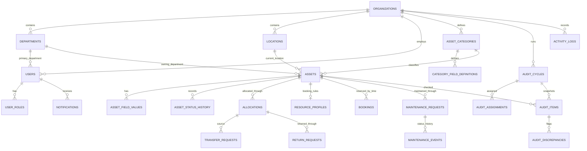

# AssetFlow — End-to-End PostgreSQL Database Design

**Status:** Final corrected MVP database baseline  
**Target:** PostgreSQL 18.4 with Prisma ORM 7.8  
**Architecture:** Single organization for the first MVP, with `organization_id` retained throughout for later multi-tenancy  
**Primary goals:** data integrity, workflow traceability, concurrency safety, role scoping, and low-conflict ownership across four engineers

---

## 1. Design decisions

1. Every business record belongs to an `organization`.
2. Users can have multiple roles.
3. `DEPARTMENT_HEAD` is department-scoped; other MVP roles are organization-scoped.
4. Assets and bookable resources share one `assets` table.
5. Bookable-only behavior is stored in a one-to-one `resource_profiles` table.
6. Future bookings do **not** globally change an asset to `RESERVED`; availability is calculated for a requested time range.
7. Allocation, transfer, return, maintenance, and audit history are separate immutable business records.
8. Asset status is not edited through generic CRUD. Workflow services change it.
9. PostgreSQL constraints are the final protection against double allocation and booking overlap.
10. Time is stored in UTC with `timestamptz`.
11. Master data is deactivated instead of deleted.
12. Historical workflow records are never cascade-deleted from normal application actions.
13. Dashboard values are queries/views over operational data, not separately maintained counters.
14. Audit scope is frozen into `audit_items` when an audit starts.
15. Attachments reference metadata in `stored_files`; binary storage remains outside PostgreSQL.
16. Persistent booking statuses are workflow states; `UPCOMING` and `ONGOING` are derived.
17. Rescheduling creates a replacement booking in one transaction and links it to the cancelled original.
18. Maintenance technicians are active internal Employees.
19. Active allocations remain open while an asset is under maintenance.
20. Future bookings affected by maintenance approval are cancelled transactionally after confirmation.

---

## 2. High-level relationship map



---

## 3. Enumerations

### Identity and organization

```text
organization_status: ACTIVE, INACTIVE
record_status: ACTIVE, INACTIVE
user_status: ACTIVE, INACTIVE, LOCKED
role_type: EMPLOYEE, ADMIN, ASSET_MANAGER, DEPARTMENT_HEAD
location_type: SITE, BUILDING, FLOOR, ROOM, AREA, OTHER
```

### Asset management

```text
asset_status:
AVAILABLE
ALLOCATED
RESERVED
UNDER_MAINTENANCE
LOST
RETIRED
DISPOSED

asset_condition:
NEW
GOOD
FAIR
POOR
DAMAGED
UNKNOWN

category_field_type:
TEXT
LONG_TEXT
INTEGER
DECIMAL
BOOLEAN
DATE
DATETIME
SELECT
MULTI_SELECT
```

`RESERVED` remains available for a future explicit hold workflow. Ordinary future bookings do not set it.

### Custody

```text
transfer_status:
PENDING
APPROVED
REJECTED
CANCELLED

return_status:
PENDING
APPROVED
REJECTED
CANCELLED

allocation_end_reason:
RETURNED
TRANSFERRED
MAINTENANCE
LOST
RETIRED
DISPOSED
ADMIN_CORRECTION
```

### Booking

```text
booking_status:
PENDING
CONFIRMED
REJECTED
CANCELLED
COMPLETED
```

`UPCOMING` and `ONGOING` are presentation states derived from `start_at`, `end_at`, and the persistent status.

### Maintenance

```text
maintenance_priority:
LOW
MEDIUM
HIGH
CRITICAL

maintenance_status:
PENDING
APPROVED
REJECTED
TECHNICIAN_ASSIGNED
IN_PROGRESS
RESOLVED
CANCELLED

maintenance_resolution_outcome:
RESTORE_PREVIOUS_ALLOCATION
MAKE_AVAILABLE
RETIRE
MARK_LOST
```

### Audit

```text
audit_cycle_status:
DRAFT
IN_PROGRESS
REVIEW
CLOSED
CANCELLED

audit_item_result:
PENDING
VERIFIED
MISSING
DAMAGED

discrepancy_type:
MISSING
DAMAGED
LOCATION_MISMATCH
CUSTODIAN_MISMATCH
OTHER

discrepancy_status:
OPEN
RESOLVED
DISMISSED

discrepancy_resolution_action:
MARK_LOST
CREATE_MAINTENANCE
CORRECT_LOCATION
CORRECT_CUSTODIAN
MARK_VERIFIED
DISMISS
```

---

# 4. Table catalog

## 4.1 `organizations`

The tenant/root boundary.

| Column | Type | Rules |
|---|---|---|
| `id` | UUID | PK |
| `name` | TEXT | required |
| `slug` | CITEXT | globally unique |
| `default_timezone` | TEXT | required |
| `status` | organization_status | default ACTIVE |
| `created_at` | TIMESTAMPTZ | required |
| `updated_at` | TIMESTAMPTZ | required |

For the MVP, seed one organization: `AssetFlow Demo`.

---

## 4.2 `departments`

Supports hierarchy and departmental scope.

| Column | Type | Rules |
|---|---|---|
| `id` | UUID | PK |
| `organization_id` | UUID | FK organizations |
| `parent_department_id` | UUID | nullable self-FK |
| `code` | CITEXT | unique per organization |
| `name` | TEXT | required |
| `description` | TEXT | nullable |
| `status` | record_status | default ACTIVE |
| `created_by_user_id` | UUID | nullable FK users |
| `created_at` | TIMESTAMPTZ | required |
| `updated_at` | TIMESTAMPTZ | required |

A department head is represented through `user_roles`, not duplicated here.

---

## 4.3 `locations`

Normalized physical-location hierarchy.

| Column | Type | Rules |
|---|---|---|
| `id` | UUID | PK |
| `organization_id` | UUID | FK organizations |
| `parent_location_id` | UUID | nullable self-FK |
| `code` | CITEXT | unique per organization |
| `name` | TEXT | required |
| `type` | location_type | required |
| `description` | TEXT | nullable |
| `status` | record_status | default ACTIVE |
| `created_at` | TIMESTAMPTZ | required |
| `updated_at` | TIMESTAMPTZ | required |

Examples:

```text
Ahmedabad Campus
└── Main Building
    ├── Floor 1
    │   ├── Room 101
    │   └── Engineering Store
    └── Floor 2
```

---

## 4.4 `users`

Combines the employee directory and authenticated account for the MVP.

| Column | Type | Rules |
|---|---|---|
| `id` | UUID | PK |
| `organization_id` | UUID | FK organizations |
| `primary_department_id` | UUID | nullable FK departments |
| `employee_code` | CITEXT | unique per organization, nullable |
| `first_name` | TEXT | required |
| `last_name` | TEXT | nullable |
| `email` | CITEXT | unique per organization |
| `password_hash` | TEXT | required |
| `status` | user_status | default ACTIVE |
| `last_login_at` | TIMESTAMPTZ | nullable |
| `created_at` | TIMESTAMPTZ | required |
| `updated_at` | TIMESTAMPTZ | required |

The password hash stores the complete scrypt hash envelope, never a plain password.

---

## 4.5 `user_roles`

Supports multiple roles and department-scoped Department Heads.

| Column | Type | Rules |
|---|---|---|
| `id` | UUID | PK |
| `organization_id` | UUID | FK organizations |
| `user_id` | UUID | FK users |
| `role` | role_type | required |
| `department_id` | UUID | required only for DEPARTMENT_HEAD |
| `assigned_by_user_id` | UUID | nullable FK users |
| `assigned_at` | TIMESTAMPTZ | required |
| `revoked_by_user_id` | UUID | nullable FK users |
| `revoked_at` | TIMESTAMPTZ | nullable |

Constraints:

- every user gets `EMPLOYEE`;
- only `DEPARTMENT_HEAD` may have `department_id`;
- one active global assignment per user and role;
- one active department role assignment per user, role, and department;
- one active Department Head per department in the MVP.

---

## 4.6 `sessions`

Database-backed opaque sessions.

| Column | Type | Rules |
|---|---|---|
| `id` | UUID | PK |
| `organization_id` | UUID | FK organizations |
| `user_id` | UUID | FK users |
| `token_hash` | TEXT | globally unique |
| `ip_address` | INET | nullable |
| `user_agent` | TEXT | nullable |
| `created_at` | TIMESTAMPTZ | required |
| `last_seen_at` | TIMESTAMPTZ | required |
| `expires_at` | TIMESTAMPTZ | required |
| `revoked_at` | TIMESTAMPTZ | nullable |

Only the hash of the cookie token is stored.

---

## 4.7 `password_reset_tokens`

Optional now, compatible with the forgot-password screen later.

| Column | Type | Rules |
|---|---|---|
| `id` | UUID | PK |
| `user_id` | UUID | FK users |
| `token_hash` | TEXT | globally unique |
| `created_at` | TIMESTAMPTZ | required |
| `expires_at` | TIMESTAMPTZ | required |
| `used_at` | TIMESTAMPTZ | nullable |

---

## 4.8 `asset_categories`

Organization-owned categories.

| Column | Type | Rules |
|---|---|---|
| `id` | UUID | PK |
| `organization_id` | UUID | FK organizations |
| `code` | CITEXT | unique per organization |
| `name` | TEXT | required |
| `description` | TEXT | nullable |
| `default_useful_life_months` | INTEGER | nullable |
| `default_warranty_months` | INTEGER | nullable |
| `status` | record_status | default ACTIVE |
| `created_at` | TIMESTAMPTZ | required |
| `updated_at` | TIMESTAMPTZ | required |

---

## 4.9 `category_field_definitions`

Optional category-specific fields.

| Column | Type | Rules |
|---|---|---|
| `id` | UUID | PK |
| `organization_id` | UUID | FK organizations |
| `category_id` | UUID | FK asset_categories |
| `field_key` | CITEXT | unique within category |
| `label` | TEXT | required |
| `field_type` | category_field_type | required |
| `is_required` | BOOLEAN | default false |
| `options_json` | JSONB | required only for select fields |
| `validation_json` | JSONB | optional min/max/pattern rules |
| `sort_order` | INTEGER | default 0 |
| `status` | record_status | default ACTIVE |
| `created_at` | TIMESTAMPTZ | required |
| `updated_at` | TIMESTAMPTZ | required |

Examples:

- Electronics: warranty period, MAC address
- Vehicle: registration number, fuel type
- Room: capacity, amenities

---

## 4.10 `assets`

The central physical asset and resource table.

| Column | Type | Rules |
|---|---|---|
| `id` | UUID | PK |
| `organization_id` | UUID | FK organizations |
| `asset_tag` | CITEXT | unique per organization |
| `qr_token` | UUID | unique, generated, immutable |
| `qr_code` | CITEXT | nullable, unique per organization when present |
| `name` | TEXT | required |
| `description` | TEXT | nullable |
| `category_id` | UUID | FK asset_categories |
| `serial_number` | CITEXT | nullable, unique per organization when present |
| `owning_department_id` | UUID | nullable FK departments |
| `current_location_id` | UUID | nullable FK locations |
| `status` | asset_status | required |
| `condition` | asset_condition | required |
| `is_bookable` | BOOLEAN | default false |
| `acquisition_date` | DATE | nullable |
| `acquisition_cost_minor` | BIGINT | nullable, nonnegative |
| `acquisition_currency` | CHAR(3) | nullable |
| `warranty_expires_on` | DATE | nullable |
| `expected_retirement_on` | DATE | nullable |
| `created_by_user_id` | UUID | FK users |
| `version` | INTEGER | default 1 |
| `created_at` | TIMESTAMPTZ | required |
| `updated_at` | TIMESTAMPTZ | required |

`version` supports optimistic locking for metadata edits.

---

## 4.11 `asset_field_values`

Typed flexible values stored as JSONB.

| Column | Type | Rules |
|---|---|---|
| `id` | UUID | PK |
| `organization_id` | UUID | FK organizations |
| `asset_id` | UUID | FK assets |
| `field_definition_id` | UUID | FK category_field_definitions |
| `value_json` | JSONB | required |
| `created_at` | TIMESTAMPTZ | required |
| `updated_at` | TIMESTAMPTZ | required |

Unique: `(asset_id, field_definition_id)`.

The service validates that the field belongs to the asset's category and that the JSON value matches the declared field type.

---

## 4.12 `stored_files`

Metadata for external object storage or development URLs.

| Column | Type | Rules |
|---|---|---|
| `id` | UUID | PK |
| `organization_id` | UUID | FK organizations |
| `storage_provider` | TEXT | required |
| `storage_key` | TEXT | required |
| `original_filename` | TEXT | required |
| `mime_type` | TEXT | required |
| `size_bytes` | BIGINT | required, nonnegative |
| `checksum_sha256` | TEXT | nullable |
| `uploaded_by_user_id` | UUID | nullable FK users |
| `created_at` | TIMESTAMPTZ | required |
| `deleted_at` | TIMESTAMPTZ | nullable |

---

## 4.13 `asset_attachments`

| Column | Type | Rules |
|---|---|---|
| `asset_id` | UUID | FK assets |
| `file_id` | UUID | FK stored_files |
| `attachment_type` | TEXT | PHOTO, DOCUMENT, MANUAL, OTHER |
| `created_at` | TIMESTAMPTZ | required |

Composite PK: `(asset_id, file_id)`.

---

## 4.14 `asset_status_history`

Append-only lifecycle history.

| Column | Type | Rules |
|---|---|---|
| `id` | UUID | PK |
| `organization_id` | UUID | FK organizations |
| `asset_id` | UUID | FK assets |
| `from_status` | asset_status | nullable for registration |
| `to_status` | asset_status | required |
| `reason_code` | TEXT | required |
| `reason_text` | TEXT | nullable |
| `source_type` | TEXT | ALLOCATION, TRANSFER, RETURN, MAINTENANCE, AUDIT, ADMIN |
| `source_id` | UUID | nullable |
| `changed_by_user_id` | UUID | nullable FK users |
| `changed_at` | TIMESTAMPTZ | required |

This table is never updated.

---

# 5. Custody tables

## 5.1 `allocations`

Represents physical custody.

| Column | Type | Rules |
|---|---|---|
| `id` | UUID | PK |
| `organization_id` | UUID | FK organizations |
| `asset_id` | UUID | FK assets |
| `allocated_to_user_id` | UUID | nullable FK users |
| `allocated_to_department_id` | UUID | nullable FK departments |
| `allocated_by_user_id` | UUID | FK users |
| `allocated_at` | TIMESTAMPTZ | required |
| `expected_return_at` | TIMESTAMPTZ | nullable |
| `checkout_condition` | asset_condition | required |
| `checkout_notes` | TEXT | nullable |
| `ended_at` | TIMESTAMPTZ | nullable |
| `ended_by_user_id` | UUID | nullable FK users |
| `end_reason` | allocation_end_reason | nullable |
| `checkin_condition` | asset_condition | nullable |
| `checkin_notes` | TEXT | nullable |
| `created_at` | TIMESTAMPTZ | required |

Rules:

- exactly one of `allocated_to_user_id` and `allocated_to_department_id`;
- one active allocation per asset;
- `ended_at` and `end_reason` are set together;
- historical rows remain immutable after closure except controlled correction.

---

## 5.2 `transfer_requests`

| Column | Type | Rules |
|---|---|---|
| `id` | UUID | PK |
| `organization_id` | UUID | FK organizations |
| `asset_id` | UUID | FK assets |
| `source_allocation_id` | UUID | FK allocations |
| `requested_by_user_id` | UUID | FK users |
| `to_user_id` | UUID | nullable FK users |
| `to_department_id` | UUID | nullable FK departments |
| `reason` | TEXT | required |
| `status` | transfer_status | default PENDING |
| `decided_by_user_id` | UUID | nullable FK users |
| `decided_at` | TIMESTAMPTZ | nullable |
| `decision_notes` | TEXT | nullable |
| `resulting_allocation_id` | UUID | nullable unique FK allocations |
| `created_at` | TIMESTAMPTZ | required |
| `updated_at` | TIMESTAMPTZ | required |

Approval transaction:

1. lock source allocation;
2. confirm it is still active;
3. confirm the asset is not under maintenance;
4. close source allocation with `TRANSFERRED`;
5. create new allocation;
6. update asset status/current context;
7. mark request approved;
8. create status history, notification, and activity log.

---

## 5.3 `return_requests`

| Column | Type | Rules |
|---|---|---|
| `id` | UUID | PK |
| `organization_id` | UUID | FK organizations |
| `allocation_id` | UUID | FK allocations |
| `requested_by_user_id` | UUID | FK users |
| `status` | return_status | default PENDING |
| `proposed_condition` | asset_condition | nullable |
| `request_notes` | TEXT | nullable |
| `decided_by_user_id` | UUID | nullable FK users |
| `decided_at` | TIMESTAMPTZ | nullable |
| `checkin_condition` | asset_condition | nullable |
| `checkin_notes` | TEXT | nullable |
| `decision_notes` | TEXT | nullable |
| `created_at` | TIMESTAMPTZ | required |
| `updated_at` | TIMESTAMPTZ | required |

Only one pending return request may exist for an allocation.

---

# 6. Booking tables

## 6.1 `resource_profiles`

One-to-one configuration for `assets.is_bookable = true`.

| Column | Type | Rules |
|---|---|---|
| `asset_id` | UUID | PK and FK assets |
| `organization_id` | UUID | FK organizations |
| `timezone` | TEXT | required |
| `minimum_duration_minutes` | INTEGER | default 15 |
| `maximum_duration_minutes` | INTEGER | nullable |
| `buffer_before_minutes` | INTEGER | default 0 |
| `buffer_after_minutes` | INTEGER | default 0 |
| `advance_booking_days` | INTEGER | nullable |
| `requires_approval` | BOOLEAN | default false |
| `allow_department_booking` | BOOLEAN | default true |
| `created_at` | TIMESTAMPTZ | required |
| `updated_at` | TIMESTAMPTZ | required |

The exclusion constraint uses the effective interval including buffers if buffers are implemented as stored effective timestamps. For the MVP, the API can apply buffers before insertion.

---

## 6.2 `bookings`

| Column | Type | Rules |
|---|---|---|
| `id` | UUID | PK |
| `organization_id` | UUID | FK organizations |
| `asset_id` | UUID | FK assets |
| `requested_by_user_id` | UUID | FK users |
| `booked_for_user_id` | UUID | nullable FK users |
| `booked_for_department_id` | UUID | nullable FK departments |
| `title` | TEXT | required |
| `purpose` | TEXT | nullable |
| `start_at` | TIMESTAMPTZ | required |
| `end_at` | TIMESTAMPTZ | required |
| `effective_start_at` | TIMESTAMPTZ | required |
| `effective_end_at` | TIMESTAMPTZ | required |
| `status` | booking_status | required |
| `approved_by_user_id` | UUID | nullable FK users |
| `approved_at` | TIMESTAMPTZ | nullable |
| `rejected_by_user_id` | UUID | nullable FK users |
| `rejected_at` | TIMESTAMPTZ | nullable |
| `cancelled_by_user_id` | UUID | nullable FK users |
| `cancelled_at` | TIMESTAMPTZ | nullable |
| `cancellation_reason` | TEXT | nullable |
| `completed_at` | TIMESTAMPTZ | nullable |
| `rescheduled_from_booking_id` | UUID | nullable unique self-FK; replacement points to cancelled original |
| `created_at` | TIMESTAMPTZ | required |
| `updated_at` | TIMESTAMPTZ | required |

Rules:

- exactly one of booked-for user and department;
- `start_at < end_at`;
- `effective_start_at <= start_at`;
- `effective_end_at >= end_at`;
- pending and confirmed effective intervals cannot overlap for the same asset;
- rescheduling validates and inserts the replacement before committing cancellation of the original;
- only assets with an active resource profile can be booked;
- no new booking while asset status is under maintenance, lost, retired, or disposed.

Display status:

```text
CANCELLED                   → Cancelled
COMPLETED                   → Completed
CONFIRMED and now < start   → Upcoming
CONFIRMED and start <= now < end → Ongoing
CONFIRMED and now >= end    → Completed candidate
```

A scheduled job may persist `COMPLETED`; the UI can also derive it safely.

---

# 7. Maintenance tables

## 7.1 `maintenance_requests`

| Column | Type | Rules |
|---|---|---|
| `id` | UUID | PK |
| `organization_id` | UUID | FK organizations |
| `asset_id` | UUID | FK assets |
| `requested_by_user_id` | UUID | FK users |
| `issue_description` | TEXT | required |
| `priority` | maintenance_priority | required |
| `status` | maintenance_status | default PENDING |
| `assigned_technician_user_id` | UUID | nullable FK users; required from TECHNICIAN_ASSIGNED onward |
| `approved_by_user_id` | UUID | nullable FK users |
| `approved_at` | TIMESTAMPTZ | nullable |
| `rejected_by_user_id` | UUID | nullable FK users |
| `rejected_at` | TIMESTAMPTZ | nullable |
| `rejection_reason` | TEXT | nullable |
| `started_at` | TIMESTAMPTZ | nullable |
| `resolved_by_user_id` | UUID | nullable FK users |
| `resolved_at` | TIMESTAMPTZ | nullable |
| `resolution_notes` | TEXT | nullable |
| `resolution_outcome` | maintenance_resolution_outcome | nullable |
| `previous_asset_status` | asset_status | nullable |
| `previous_allocation_id` | UUID | nullable FK allocations |
| `created_at` | TIMESTAMPTZ | required |
| `updated_at` | TIMESTAMPTZ | required |

One unresolved maintenance request per asset in the MVP.

Approval transaction, after explicit confirmation:

1. lock asset;
2. verify allowed status;
3. preserve previous status and active allocation reference;
4. keep the active allocation open;
5. cancel future `PENDING` and `CONFIRMED` bookings and enqueue notifications;
6. set asset to `UNDER_MAINTENANCE`;
7. mark request approved;
8. append status and activity history.

Technician assignment requires an active Employee. Resolution restores `ALLOCATED` when an active allocation remains, otherwise `AVAILABLE`, unless the outcome is `RETIRE` or `MARK_LOST`.

---

## 7.2 `maintenance_events`

Append-only request timeline.

| Column | Type | Rules |
|---|---|---|
| `id` | UUID | PK |
| `organization_id` | UUID | FK organizations |
| `maintenance_request_id` | UUID | FK maintenance_requests |
| `from_status` | maintenance_status | nullable |
| `to_status` | maintenance_status | required |
| `performed_by_user_id` | UUID | nullable FK users |
| `notes` | TEXT | nullable |
| `metadata_json` | JSONB | nullable |
| `created_at` | TIMESTAMPTZ | required |

---

## 7.3 `maintenance_attachments`

Composite relation between maintenance requests and stored files.

---

# 8. Audit tables

## 8.1 `audit_cycles`

| Column | Type | Rules |
|---|---|---|
| `id` | UUID | PK |
| `organization_id` | UUID | FK organizations |
| `code` | CITEXT | unique per organization |
| `name` | TEXT | required |
| `description` | TEXT | nullable |
| `status` | audit_cycle_status | default DRAFT |
| `scheduled_start_on` | DATE | nullable |
| `scheduled_end_on` | DATE | nullable |
| `created_by_user_id` | UUID | FK users |
| `started_by_user_id` | UUID | nullable FK users |
| `started_at` | TIMESTAMPTZ | nullable |
| `review_started_at` | TIMESTAMPTZ | nullable |
| `closed_by_user_id` | UUID | nullable FK users |
| `closed_at` | TIMESTAMPTZ | nullable |
| `created_at` | TIMESTAMPTZ | required |
| `updated_at` | TIMESTAMPTZ | required |

---

## 8.2 `audit_cycle_departments`

Defines department scope before the cycle starts.

| Column | Type |
|---|---|
| `audit_cycle_id` | UUID |
| `department_id` | UUID |
| `include_descendants` | BOOLEAN |

Composite PK: `(audit_cycle_id, department_id)`.

---

## 8.3 `audit_cycle_locations`

Defines location scope before the cycle starts.

| Column | Type |
|---|---|
| `audit_cycle_id` | UUID |
| `location_id` | UUID |
| `include_descendants` | BOOLEAN |

Composite PK: `(audit_cycle_id, location_id)`.

At least one department or location scope must exist before starting.

---

## 8.4 `audit_assignments`

| Column | Type | Rules |
|---|---|---|
| `id` | UUID | PK |
| `organization_id` | UUID | FK organizations |
| `audit_cycle_id` | UUID | FK audit_cycles |
| `auditor_user_id` | UUID | FK users |
| `assigned_by_user_id` | UUID | FK users |
| `assigned_at` | TIMESTAMPTZ | required |
| `revoked_at` | TIMESTAMPTZ | nullable |

Unique active assignment per cycle and auditor.

---

## 8.5 `audit_items`

Frozen asset snapshot created at audit start.

| Column | Type | Rules |
|---|---|---|
| `id` | UUID | PK |
| `organization_id` | UUID | FK organizations |
| `audit_cycle_id` | UUID | FK audit_cycles |
| `asset_id` | UUID | FK assets |
| `snapshot_asset_tag` | TEXT | required |
| `snapshot_asset_name` | TEXT | required |
| `expected_status` | asset_status | required |
| `expected_condition` | asset_condition | required |
| `expected_location_id` | UUID | nullable FK locations |
| `expected_department_id` | UUID | nullable FK departments |
| `expected_holder_user_id` | UUID | nullable FK users |
| `expected_holder_department_id` | UUID | nullable FK departments |
| `result` | audit_item_result | default PENDING |
| `observed_location_id` | UUID | nullable FK locations |
| `observed_condition` | asset_condition | nullable |
| `checked_by_user_id` | UUID | nullable FK users |
| `checked_at` | TIMESTAMPTZ | nullable |
| `notes` | TEXT | nullable |
| `created_at` | TIMESTAMPTZ | required |
| `updated_at` | TIMESTAMPTZ | required |

Unique: `(audit_cycle_id, asset_id)`.

Snapshot text is deliberately duplicated so an old audit remains readable after asset metadata changes.

---

## 8.6 `audit_discrepancies`

| Column | Type | Rules |
|---|---|---|
| `id` | UUID | PK |
| `organization_id` | UUID | FK organizations |
| `audit_item_id` | UUID | FK audit_items |
| `type` | discrepancy_type | required |
| `status` | discrepancy_status | default OPEN |
| `details` | TEXT | nullable |
| `resolution_action` | discrepancy_resolution_action | nullable |
| `resolution_notes` | TEXT | nullable |
| `resolved_by_user_id` | UUID | nullable FK users |
| `resolved_at` | TIMESTAMPTZ | nullable |
| `related_maintenance_request_id` | UUID | nullable FK maintenance_requests |
| `created_at` | TIMESTAMPTZ | required |
| `updated_at` | TIMESTAMPTZ | required |

Closing an audit requires:

- every item is no longer `PENDING`;
- every discrepancy is `RESOLVED` or `DISMISSED`.

Closed cycle items and discrepancies are immutable.

---

# 9. Communication and traceability

## 9.1 `notifications`

| Column | Type | Rules |
|---|---|---|
| `id` | UUID | PK |
| `organization_id` | UUID | FK organizations |
| `recipient_user_id` | UUID | FK users |
| `type` | TEXT | stable application code |
| `title` | TEXT | required |
| `body` | TEXT | required |
| `entity_type` | TEXT | nullable |
| `entity_id` | UUID | nullable |
| `dedup_key` | TEXT | nullable |
| `read_at` | TIMESTAMPTZ | nullable |
| `created_at` | TIMESTAMPTZ | required |

A partial unique index on `(recipient_user_id, dedup_key)` prevents duplicate scheduled notifications.

---

## 9.2 `activity_logs`

Append-only audit log.

| Column | Type | Rules |
|---|---|---|
| `id` | UUID | PK |
| `organization_id` | UUID | FK organizations |
| `actor_user_id` | UUID | nullable FK users |
| `action` | TEXT | stable application code |
| `entity_type` | TEXT | required |
| `entity_id` | UUID | nullable |
| `request_id` | UUID | nullable |
| `summary` | TEXT | required |
| `before_json` | JSONB | nullable |
| `after_json` | JSONB | nullable |
| `ip_address` | INET | nullable |
| `user_agent` | TEXT | nullable |
| `created_at` | TIMESTAMPTZ | required |

Normal application roles cannot update or delete these records.

---

## 9.3 `job_runs`

Recommended for idempotent scheduled work.

| Column | Type | Rules |
|---|---|---|
| `id` | UUID | PK |
| `organization_id` | UUID | nullable FK organizations |
| `job_name` | TEXT | required |
| `idempotency_key` | TEXT | unique |
| `status` | TEXT | STARTED, SUCCEEDED, FAILED |
| `started_at` | TIMESTAMPTZ | required |
| `finished_at` | TIMESTAMPTZ | nullable |
| `result_json` | JSONB | nullable |
| `error_text` | TEXT | nullable |

Examples:

- overdue-return notification generation;
- booking completion;
- upcoming booking reminders.

---

# 10. Critical indexes and constraints

## 10.1 Double allocation

```sql
CREATE UNIQUE INDEX uq_allocations_one_active_per_asset
ON allocations (asset_id)
WHERE ended_at IS NULL;
```

This protects against concurrent requests even when both API pre-checks pass.

## 10.2 Booking overlap

```sql
CREATE EXTENSION IF NOT EXISTS btree_gist;

ALTER TABLE bookings
ADD CONSTRAINT bookings_no_active_overlap
EXCLUDE USING gist (
  asset_id WITH =,
  tstzrange(effective_start_at, effective_end_at, '[)') WITH &&
)
WHERE (status IN ('PENDING', 'CONFIRMED'));
```

The interval is half-open: `[start, end)`.

## 10.3 One active maintenance request per asset

```sql
CREATE UNIQUE INDEX uq_maintenance_one_open_per_asset
ON maintenance_requests (asset_id)
WHERE status IN (
  'PENDING',
  'APPROVED',
  'TECHNICIAN_ASSIGNED',
  'IN_PROGRESS'
);
```

## 10.4 One pending transfer per source allocation

```sql
CREATE UNIQUE INDEX uq_transfer_one_pending_per_allocation
ON transfer_requests (source_allocation_id)
WHERE status = 'PENDING';
```

## 10.5 One pending return per allocation

```sql
CREATE UNIQUE INDEX uq_return_one_pending_per_allocation
ON return_requests (allocation_id)
WHERE status = 'PENDING';
```

## 10.6 Search indexes

```text
assets: organization_id + status
assets: organization_id + category_id
assets: organization_id + owning_department_id
assets: organization_id + current_location_id
assets: lower(name) trigram index if needed
allocations: allocated_to_user_id where active
allocations: allocated_to_department_id where active
allocations: expected_return_at where active
bookings: asset_id + start_at
maintenance_requests: organization_id + status + priority
audit_items: audit_cycle_id + result
notifications: recipient_user_id + read_at + created_at desc
activity_logs: organization_id + created_at desc
```

Add `pg_trgm` only when partial-name search is implemented.

---

# 11. Workflow consistency rules

These rules belong in domain services and integration tests.

## Asset registration

```text
new asset → AVAILABLE
```

Exceptions:

- imported retired asset may start `RETIRED` only through an explicit import command;
- no generic endpoint accepts arbitrary starting status.

## Allocation

Allowed when asset is:

```text
AVAILABLE
```

Rejected when:

```text
ALLOCATED
UNDER_MAINTENANCE
LOST
RETIRED
DISPOSED
```

Successful allocation:

- create active allocation;
- set asset status `ALLOCATED`;
- append asset status history;
- notify recipient;
- write activity log.

## Return

Approval:

- lock active allocation;
- close allocation;
- set check-in condition;
- set asset condition;
- set asset status `AVAILABLE`, unless damage requires immediate maintenance;
- append history and notifications.

## Transfer

Approval is one transaction:

```text
close old allocation
+ create new allocation
+ preserve asset status ALLOCATED
+ link resulting allocation
```

## Booking

Booking is independent of long-term allocation unless the resource policy says otherwise.

For the MVP:

- a meeting room can be bookable and unallocated;
- a vehicle or projector can be bookable only when not allocated;
- `UPCOMING` and `ONGOING` are derived from confirmed bookings;
- atomic rescheduling creates a linked replacement and cancels the original in one transaction;
- the service checks asset and resource policy before creation.

## Maintenance

Approval:

```text
keep active allocation open
+ cancel affected future bookings after confirmation
+ asset → UNDER_MAINTENANCE
```

Resolution:

```text
RESTORE_PREVIOUS_ALLOCATION → ALLOCATED
MAKE_AVAILABLE              → AVAILABLE
RETIRE                      → RETIRED
MARK_LOST                   → LOST
```

## Audit

Start:

```text
resolve scope
→ copy assets into audit_items
→ status IN_PROGRESS
```

Result:

```text
VERIFIED → no discrepancy unless location/custodian mismatch
MISSING  → MISSING discrepancy
DAMAGED  → DAMAGED discrepancy
```

Close:

```text
all items checked
AND all discrepancies resolved/dismissed
→ CLOSED
```

---

# 12. Recommended database views

Views keep dashboard/report logic consistent.

## `v_current_allocations`

Returns active allocation with human-readable holder information.

## `v_overdue_allocations`

```sql
SELECT *
FROM allocations
WHERE ended_at IS NULL
  AND expected_return_at IS NOT NULL
  AND expected_return_at < now();
```

## `v_booking_display_status`

Derives `UPCOMING`, `ONGOING`, `COMPLETED`, or `CANCELLED` from persistent booking state and time.

## `v_asset_operational_summary`

One row per asset with:

- category;
- location;
- owning department;
- active holder;
- current open maintenance request;
- next booking;
- latest audit result.

Use a normal view initially. Consider a materialized view only after measuring actual query cost.

## Report definitions

Default window: previous 90 days.

- Allocation utilization = allocated duration / in-service duration.
- Booking utilization = confirmed booking minutes / configured bookable minutes.
- Idle asset = available, no active allocation, and no allocation or confirmed-booking activity for 60 days.
- Open and aging maintenance = unresolved maintenance requests grouped into age buckets.
- Nearing retirement = `expected_retirement_on` within 90 days, or asset age within 90 days of `asset_categories.default_useful_life_months`.

Preventive-maintenance due dates are not inferred because preventive-maintenance scheduling is outside the MVP.

---

# 13. Multi-tenancy path

The MVP has one organization, but the schema is tenant-aware.

Before supporting multiple production tenants, add:

1. composite same-organization foreign keys, or equivalent database enforcement;
2. PostgreSQL row-level security;
3. tenant-aware background jobs;
4. organization-scoped asset-tag sequences;
5. tenant-scoped object-storage paths;
6. tenant-aware unique indexes everywhere;
7. security tests attempting cross-organization IDs.

Application filtering alone is not sufficient for production multi-tenancy.

---

# 14. Four-person database ownership

Only the Platform Owner edits `schema.prisma` and migration history. Domain owners submit model changes and review generated migrations.

| Owner | Database scope |
|---|---|
| P1 — Platform | organizations, users, roles, sessions, stored_files, notifications, activity_logs, job_runs, schema/migrations |
| P2 — Organization/Assets | departments, locations, categories, category fields, assets, custom values, asset attachments, asset status history |
| P3 — Custody/Booking | allocations, transfers, returns, resource profiles, bookings, concurrency constraints |
| P4 — Maintenance/Audit/Reports | maintenance, audit cycles/scopes/items/discrepancies, report views |

Migration process:

1. domain owner writes a short schema-change proposal;
2. P1 updates Prisma schema;
3. P1 generates one migration;
4. domain owner reviews semantics;
5. P3 reviews concurrency-sensitive changes;
6. CI migrates an empty PostgreSQL database;
7. integration tests verify constraints;
8. migration is merged before dependent feature PRs.

---

# 15. Migration order

```text
001 extensions and enums
002 organizations
003 departments and locations
004 users, roles, sessions
005 categories and custom-field definitions
006 assets, files, custom values, status history
007 allocations, transfers, returns
008 resource profiles and bookings
009 maintenance
010 audit cycles and snapshots
011 notifications, activity logs, job runs
012 indexes, exclusion constraints, immutable-history triggers
013 views
014 deterministic seed
```

Never modify a merged migration. Add a new corrective migration.

---

# 16. MVP seed shape

```text
Organization
- AssetFlow Demo

Departments
- Engineering
- Facilities
- Finance

Locations
- Ahmedabad Campus
  - Main Building
    - Floor 1
      - Engineering Store
      - Room B2
    - Parking

Users
- admin@assetflow.local       ADMIN + EMPLOYEE
- manager@assetflow.local     ASSET_MANAGER + EMPLOYEE
- head@assetflow.local        DEPARTMENT_HEAD(Engineering) + EMPLOYEE
- employee@assetflow.local    EMPLOYEE

Assets
- AF-0001 Laptop — AVAILABLE
- AF-0002 Laptop — ALLOCATED
- AF-0003 Projector — AVAILABLE, bookable
- AF-0004 Room B2 — AVAILABLE, bookable
- AF-0005 Vehicle — AVAILABLE, bookable
- AF-0006 Printer — UNDER_MAINTENANCE

Operational records
- one overdue allocation
- one future room booking
- one pending transfer
- one pending maintenance request and one technician-assigned request
- one in-progress audit with three items
```

---

# 17. Implementation boundary

The database guarantees:

- uniqueness;
- referential integrity;
- one active allocation;
- no overlapping active booking interval;
- valid basic field combinations;
- append-only activity history where triggers are enabled.

The service layer guarantees:

- role authorization;
- department scope;
- legal state transitions;
- organization isolation;
- cross-table workflow consistency;
- notification generation;
- activity-log content;
- user-friendly conflict errors.

The frontend guarantees:

- usability;
- field guidance;
- early validation;
- role-aware controls.

The frontend is never the final security or integrity boundary.

---

# 18. Deliverables accompanying this document

- `assetflow_schema.sql` — executable PostgreSQL baseline
- this logical design document
- Prisma schema should be generated from the same model and reviewed against the SQL constraints
- raw SQL migrations remain necessary for exclusion and partial indexes
